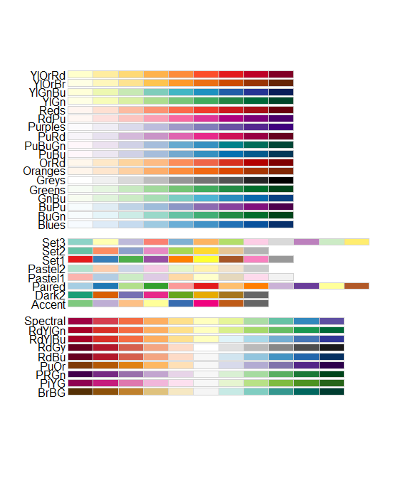
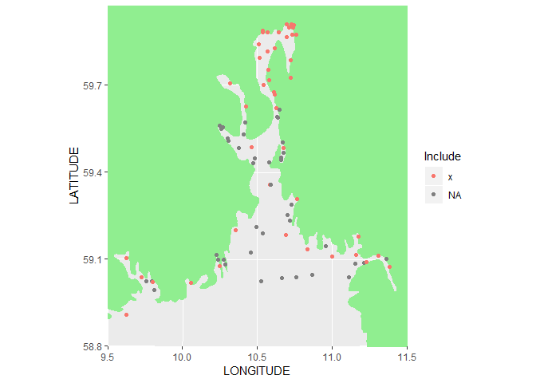
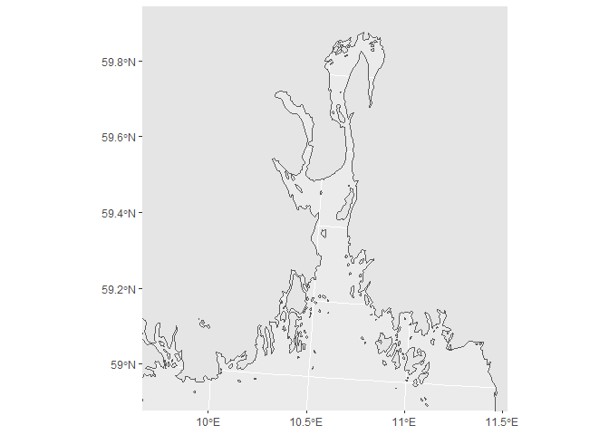
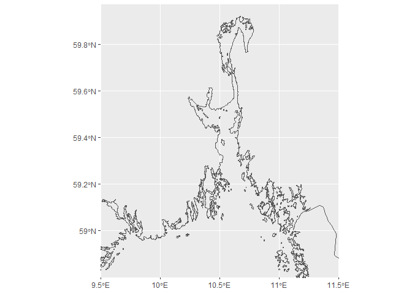

## Libs

```r
library(dplyr)
```

```
## 
## Attaching package: 'dplyr'
```

```
## The following objects are masked from 'package:stats':
## 
##     filter, lag
```

```
## The following objects are masked from 'package:base':
## 
##     intersect, setdiff, setequal, union
```

```r
library(ggplot2)
```

```
## Registered S3 methods overwritten by 'ggplot2':
##   method         from 
##   [.quosures     rlang
##   c.quosures     rlang
##   print.quosures rlang
```

```r
library(sf)
```

```
## Linking to GEOS 3.6.1, GDAL 2.2.3, PROJ 4.9.3
```

```r
library(readxl)

library(maps)
library(mapdata)
simple_map <- map_data("worldHires", c("Norway", "Sweden"))

library(RColorBrewer)
```

### 

```r
RColorBrewer::display.brewer.all()
```

<!-- -->


## Data + find ranges

```r
df_stations <- readxl::read_excel("01_Station_positions_for_map.xlsx") %>%
  mutate(Project = factor(Project, levels = c("Indre Oslofjord", "Ytre Oslofjord", "Økokyst"))) # for right order
         
apply(df_stations, 2, min)
```

```
##             Project        STATION_CODE        STATION_NAME 
##   "Indre Oslofjord"               "Ap1"            "Akerøy" 
##             Include           LONGITUDE            LATITUDE 
##                  NA          " 9.61800"          "58.90690" 
##          PROJECT_ID          STATION_ID   STATION_IS_ACTIVE 
##                  NA                  NA                  NA 
## PROJECTS_STATION_ID         GEOM_REF_ID 
##                  NA                  NA
```

```r
apply(df_stations, 2, max)
```

```
##             Project        STATION_CODE        STATION_NAME 
##           "Økokyst"               "Ø-1"            "Østøya" 
##             Include           LONGITUDE            LATITUDE 
##                  NA          "11.38503"          "59.90902" 
##          PROJECT_ID          STATION_ID   STATION_IS_ACTIVE 
##                  NA                  NA                  NA 
## PROJECTS_STATION_ID         GEOM_REF_ID 
##                  NA                  NA
```

```r
df_stations %>% 
  ggplot(aes(LONGITUDE, LATITUDE, color = Include)) +
  annotation_map(simple_map, fill = "lightgreen") +
  geom_point() +
  # geom_text(aes(label = STATION_CODE), hjust = 0, nudge_x = 0.01) +
  coord_map("lambert", parameters = c(10.6, 59.8), 
            xlim = c(9.5, 11.5), ylim = c(58.8, 59.97)) 
```

<!-- -->

## Testing maps (not used)

### Test Norway (coastline) in UTM coordinates  
Problem: missing Swedish coastline....

```r
nc_norway <- st_read("K:/Kart/N1000/norge2.shp")
```

```
## Reading layer `norge2' from data source `K:\Kart\N1000\norge2.shp' using driver `ESRI Shapefile'
## Simple feature collection with 2030 features and 4 fields
## geometry type:  POLYGON
## dimension:      XY
## bbox:           xmin: -75844 ymin: 6449504 xmax: 1114610 ymax: 7939790
## epsg (SRID):    NA
## proj4string:    NA
```

```r
st_crs(nc_norway) <- "+proj=utm +zone=33"  # set coordinate system

gg_background <- ggplot(nc_norway) + 
  geom_sf() +
  coord_sf(xlim = c(192606, 300000), ylim = c(6548705, 6667857) - 10000, 
         expand = FALSE)
gg_background
```

<!-- -->

### Europe map  
What is the projection?  

```r
nc_eur <- st_read("K:/Kart/Kystshape/Europa/LinjeshapeE250")
```

```
## Reading layer `europa000' from data source `K:\Kart\Kystshape\Europa\LinjeshapeE250' using driver `ESRI Shapefile'
## replacing null geometries with empty geometries
## Simple feature collection with 60106 features and 1 field (with 133 geometries empty)
## geometry type:  LINESTRING
## dimension:      XY
## bbox:           xmin: -26 ymin: 34 xmax: 36 ymax: 72
## epsg (SRID):    NA
## proj4string:    NA
```

```r
st_crs(nc_eur) <- "+proj=longlat +ellps=WGS84"

xlim <- c(9.5, 11.5)
ylim = c(58.8, 59.97)

# pre-crop using sf_crop to speed up the plot!  
ggplot(nc_eur) +
  geom_sf() +
  coord_sf(xlim = c(9.5, 11.5), ylim = c(58.8, 59.97), 
         expand = FALSE)
```

<!-- -->

## Chosen map

### Coastline data from OpenStreetmap  
Stored as a simple data frame of x and y coordinates, with NAs separating features (e.g. islands)
* So we skip using sf at all, we just plot points as usual in ggplot  
* Coastline is added using geom_path(); line is broken up at NAs   
* We pre-filter the data to increase speed of plotting, but don't throw away the NAs
* Can still get correct projected drawing, using coord_map()   

```r
fn <- "K:/Avdeling/214-Oseanografi/DHJ/Data/Maps/coastline_skagerrak_coords_longlat.RData"
load(fn)  # loads coastline_skagerrak_coords_longlat

xlim <- c(9.5, 11.5)
ylim = c(58.8, 59.97)

gg <- 
  coastline_skagerrak_coords_longlat %>%  
  filter(is.na(x) | 
           (x > xlim[1] & x < xlim[2] & y > ylim[1] & y < ylim[2])) %>%   # prefiltering speeds up drawing
  ggplot(aes(x,y)) +
  geom_path(size = 0.35, na.rm = TRUE) + 
  coord_map("lambert", parameters = c(10.6, 59.8), 
            xlim = xlim, ylim = ylim) +
  theme()

ggsave("Figures/02_test04.png", gg)
```

```
## Saving 7 x 5 in image
```

## Plotting

### Prepare  
Colors + coastline data

```r
colors <- RColorBrewer::brewer.pal(8, "Set1")[c(1,2,5)]

df_map <- coastline_skagerrak_coords_longlat %>%
   # prefiltering speeds up drawing, but remembr to NOT throw NAs away! (Ssee '02_test01.png')
   filter(is.na(x) | (x > xlim[1] & x < xlim[2] & y > ylim[1] & y < ylim[2]))   
```


### Version 1 plots  
With points without borders  
Map 1,2,3 are for 1) Indre Oslofjord, 2) Indre + Ytre Oslofjord, 3) all three programs  
20 seconds per plot  

```r
gg <- df_stations %>% 
  filter(!is.na(Include) & Project %in% "Indre Oslofjord") %>%
  ggplot(aes(LONGITUDE, LATITUDE)) +
  geom_path(data = df_map, aes(x,y), color = "grey40", size = 0.3, na.rm = TRUE) + 
  geom_point(aes(color = Project), size = 2.5) +
  scale_color_manual(values = colors) +
  coord_map("lambert", parameters = c(10.6, 59.8), 
            xlim = c(9.5, 11.5), ylim = c(58.8, 59.97)) +
  theme(axis.title = element_blank(),
        panel.grid = element_blank(),
        panel.background = element_rect(fill = "grey95"))
# gg

ggsave("Figures/02_map1_version1.png", gg)
```

```
## Saving 7 x 5 in image
```

```r
gg <- df_stations %>% 
  filter(!is.na(Include) & Project %in% c("Indre Oslofjord", "Ytre Oslofjord")) %>%
  ggplot(aes(LONGITUDE, LATITUDE)) +
  geom_path(data = df_map, aes(x,y), color = "grey40", size = 0.3, na.rm = TRUE) + 
  geom_point(aes(color = Project), size = 2.5) +
  scale_color_manual(values = colors) +
  coord_map("lambert", parameters = c(10.6, 59.8), 
            xlim = c(9.5, 11.5), ylim = c(58.8, 59.97)) +
  theme(axis.title = element_blank(),
        panel.grid = element_blank(),
        panel.background = element_rect(fill = "grey95"))
# gg

ggsave("Figures/02_map2_version1.png", gg)
```

```
## Saving 7 x 5 in image
```

```r
gg <- df_stations %>% 
  filter(!is.na(Include)) %>%
  ggplot(aes(LONGITUDE, LATITUDE)) +
  geom_path(data = df_map, aes(x,y), color = "grey40", size = 0.3, na.rm = TRUE) + 
  geom_point(aes(color = Project), size = 2.5) +
  scale_color_manual(values = colors) +
  coord_map("lambert", parameters = c(10.6, 59.8), 
            xlim = c(9.5, 11.5), ylim = c(58.8, 59.97)) +
  theme(axis.title = element_blank(),
        panel.grid = element_blank(),
        panel.background = element_rect(fill = "grey95"))
# gg

ggsave("Figures/02_map3_version1.png", gg)
```

```
## Saving 7 x 5 in image
```


### Version 2 plots   
With points with black borders (pch = 21, and using 'fill' instead of 'color')  

```r
gg <- df_stations %>% 
  filter(!is.na(Include) & Project %in% "Indre Oslofjord") %>%
  ggplot(aes(LONGITUDE, LATITUDE)) +
  geom_path(data = df_map, aes(x,y), color = "grey40", size = 0.3, na.rm = TRUE) + 
  geom_point(aes(fill = Project), pch = 21, size = 2.5) +
  scale_fill_manual(values = colors) +
  coord_map("lambert", parameters = c(10.6, 59.8), 
            xlim = c(9.5, 11.5), ylim = c(58.8, 59.97)) +
  theme(axis.title = element_blank(),
        panel.grid = element_blank(),
        panel.background = element_rect(fill = "grey95"))
# gg

ggsave("Figures/02_map1_version2.png", gg)
```

```
## Saving 7 x 5 in image
```

```r
gg <- df_stations %>% 
  filter(!is.na(Include) & Project %in% c("Indre Oslofjord", "Ytre Oslofjord")) %>%
  ggplot(aes(LONGITUDE, LATITUDE)) +
  geom_path(data = df_map, aes(x,y), color = "grey40", size = 0.3, na.rm = TRUE) + 
  geom_point(aes(fill = Project), pch = 21, size = 2.5) +
  scale_fill_manual(values = colors) +
  coord_map("lambert", parameters = c(10.6, 59.8), 
            xlim = c(9.5, 11.5), ylim = c(58.8, 59.97)) +
  theme(axis.title = element_blank(),
        panel.grid = element_blank(),
        panel.background = element_rect(fill = "grey95"))
# gg

ggsave("Figures/02_map2_version2.png", gg)
```

```
## Saving 7 x 5 in image
```

```r
gg <- df_stations %>% 
  filter(!is.na(Include)) %>%
  ggplot(aes(LONGITUDE, LATITUDE)) +
  geom_path(data = df_map, aes(x,y), color = "grey40", size = 0.3, na.rm = TRUE) + 
  geom_point(aes(fill = Project), pch = 21, size = 2.5) +
  scale_fill_manual(values = colors) +
  coord_map("lambert", parameters = c(10.6, 59.8), 
            xlim = c(9.5, 11.5), ylim = c(58.8, 59.97)) +
  theme(axis.title = element_blank(),
        panel.grid = element_blank(),
        panel.background = element_rect(fill = "grey95"))
# gg

ggsave("Figures/02_map3_version2.png", gg)
```

```
## Saving 7 x 5 in image
```

