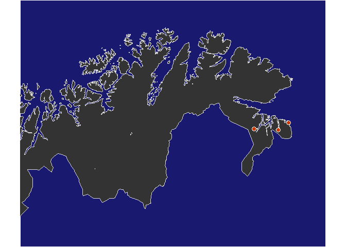

For a completely different project than script 01 and 02  

## Libs + map data

```r
library(dplyr)
```

```
## 
## Attaching package: 'dplyr'
```

```
## The following objects are masked from 'package:stats':
## 
##     filter, lag
```

```
## The following objects are masked from 'package:base':
## 
##     intersect, setdiff, setequal, union
```

```r
library(ggplot2)
```

```
## Registered S3 methods overwritten by 'ggplot2':
##   method         from 
##   [.quosures     rlang
##   c.quosures     rlang
##   print.quosures rlang
```

```r
library(sf)
```

```
## Linking to GEOS 3.6.1, GDAL 2.2.3, PROJ 4.9.3
```

```r
library(readxl)

library(maps)
library(mapdata)

# R map
# simple_map <- map_data("worldHires", "Norway")
# Somewhat better map
load("K:/Avdeling/214-Oseanografi/DHJ/Data/Maps/Norway_coastline_longlat2.RData")

# Clean away some Finnish lakes :-)
norway_coast_longlat2 <- norway_coast_longlat2 %>%
  filter(!(long>27 & long<28 & lat<69.1))

library(RColorBrewer)

# RColorBrewer::display.brewer.all()
```


## Data + find ranges

```r
fn <- "Copy of eDNA liste over prøvelokaliteter per 16.10.19 Guttorm.xlsx"
df_stations <- readxl::read_excel(
  fn, 
  col_types = c("numeric", "text", "text", "numeric", "numeric"),
  range = "A1:E100"
  ) %>%
  filter(!is.na(Innsjø)) %>%
  rename(LATITUDE = `Posisjon - midt i vannet`,
         LONGITUDE = X__1)

sel <- df_stations$Innsjø == "Kråkstadelva"
df_stations$LATITUDE[sel] <- 59.7550576
df_stations$LONGITUDE[sel] <- 10.0105251


df_stations
```

```
## # A tibble: 32 x 5
##    Løpenr Innsjø           Fylke    LATITUDE LONGITUDE
##     <dbl> <chr>            <chr>       <dbl>     <dbl>
##  1      1 Borrevannet      Vestfold     59.4     10.4 
##  2      2 Rødenessjøen     Østfold      59.6     11.6 
##  3      3 Stomperudtjernet Østfold      59.3     11.4 
##  4      4 Flesjøvannet     Østfold      59.4     11.0 
##  5      5 Vansjø           Østfold      59.4     10.9 
##  6      6 Bjørnrødvann     Østfold      59.4     10.8 
##  7      7 Akersvannet      Vestfold     59.2     10.3 
##  8      8 Bergsvannet      Vestfold     59.5     10.1 
##  9      9 Korssjøen        Vestfold     59.5     10.2 
## 10     10 Hallevannet      Vestfold     59.0      9.91
## # ... with 22 more rows
```


## Map 1

```r
df_stations %>% 
  ggplot(aes(LONGITUDE, LATITUDE)) +
  annotation_map(norway_coast_longlat2, fill = "lightgreen") +
  geom_point() +
  # geom_text(aes(label = STATION_CODE), hjust = 0, nudge_x = 0.01) +
  coord_map("lambert", parameters = c(13, 65), 
            xlim = c(3, 34), ylim = c(58, 73))
```

<!-- -->

```r
#  theme_void()
```

## Map 2

```r
col1 <- RColorBrewer::brewer.pal(8, "Set2")[7]
# col2 <- RColorBrewer::brewer.pal(8, "GnBu")[4]
col2 <- RColorBrewer::brewer.pal(8, "Greens")[3]
col3 <- "grey20"
pointfill3 <- "orangered3"
bg3 <- "midnightblue"

gg <- df_stations %>% 
  ggplot(aes(LONGITUDE, LATITUDE)) +
  annotation_map(norway_coast_longlat2, aes(long, lat), fill = col1, color = "grey35")  +
  geom_point(pch = 21, fill = "black", color = "white", size = rel(3)) +
  coord_map("lambert", parameters = c(27, 70), 
            xlim = c(20, 32), ylim = c(68, 71.5)) +
  theme_void()
gg
```

<!-- -->

```r
ggsave("Figures/03_map_finnmark_col1.png", gg, dpi = 400)
```

```
## Saving 7 x 5 in image
```

```r
gg <- df_stations %>% 
  ggplot(aes(LONGITUDE, LATITUDE)) +
  annotation_map(norway_coast_longlat2, aes(long, lat), fill = col2, color = "grey35")  +
  geom_point(pch = 21, fill = "black", color = "white", size = rel(3)) +
  coord_map("lambert", parameters = c(27, 70), 
            xlim = c(20, 32), ylim = c(68, 71.5)) +
  theme_void()
gg
```

<!-- -->

```r
ggsave("Figures/03_map_finnmark_col2.png", gg, dpi = 400)
```

```
## Saving 7 x 5 in image
```

```r
gg <- df_stations %>% 
  ggplot(aes(LONGITUDE, LATITUDE)) +
  annotation_map(norway_coast_longlat2, aes(long, lat), fill = col3, color = "grey85")  +
  geom_point(pch = 21, fill = pointfill3, color = "white", size = rel(3)) +
  coord_map("lambert", parameters = c(27, 70), 
            xlim = c(20, 32), ylim = c(68, 71.5)) +
  theme_void() +
  theme(plot.background = element_rect(fill = bg3))
gg
```

<!-- -->

```r
ggsave("Figures/03_map_finnmark_col3.png", gg, dpi = 400)
```

```
## Saving 7 x 5 in image
```

## Map 3  


```r
gg <- df_stations %>% 
  ggplot(aes(LONGITUDE, LATITUDE)) +
  annotation_map(norway_coast_longlat2, aes(long, lat), fill = col1, color = "grey35")  +
  geom_point(pch = 21, fill = "black", color = "white", size = rel(3)) +
  coord_map("lambert", parameters = c(8, 59), 
            xlim = c(5, 13), ylim = c(58, 60.1)) +
  theme_void()

ggsave("Figures/03_map_sørnorge_col1.png", gg, 
       height = 4.5, width = 7, dpi = 400)
gg
```

<!-- -->

```r
gg <- df_stations %>% 
  ggplot(aes(LONGITUDE, LATITUDE)) +
  annotation_map(norway_coast_longlat2, aes(long, lat), fill = col2, color = "grey35")  +
  geom_point(pch = 21, fill = "black", color = "white", size = rel(3)) +
  coord_map("lambert", parameters = c(8, 59), 
            xlim = c(5, 13), ylim = c(58, 60.1)) +
  theme_void()

ggsave("Figures/03_map_sørnorge_col2.png", gg, 
       height = 4.5, width = 7, dpi = 400)
gg
```

<!-- -->

```r
gg <- df_stations %>% 
  ggplot(aes(LONGITUDE, LATITUDE)) +
  annotation_map(norway_coast_longlat2, aes(long, lat), fill = col3, color = "grey85")  +
  geom_point(pch = 21, fill = pointfill3, color = "white", size = rel(3)) +
  coord_map("lambert", parameters = c(8, 59), 
            xlim = c(5, 13), ylim = c(57.8, 60.1)) +
  theme_void() +
  theme(plot.background = element_rect(fill = bg3))
gg
```

<!-- -->

```r
ggsave("Figures/03_map_østlandet_col3.png", gg, 
       height = 4.5, width = 7, dpi = 400)
```


## Map 4

```r
mapfolder <- "../../Star-walk/Nat_earth"
dir(mapfolder)
```

```
##  [1] "ne_10m_geography_regions_elevation_points.zip"
##  [2] "ne_10m_geography_regions_polys.zip"           
##  [3] "ne_10m_lakes.zip"                             
##  [4] "ne_10m_lakes_europe"                          
##  [5] "ne_10m_lakes_europe.zip"                      
##  [6] "ne_10m_land"                                  
##  [7] "ne_10m_land.zip"                              
##  [8] "ne_10m_minor_islands"                         
##  [9] "ne_10m_minor_islands.zip"                     
## [10] "ne_10m_rivers_europe"                         
## [11] "ne_10m_rivers_europe.zip"                     
## [12] "ne_10m_rivers_lake_centerlines.zip"
```

```r
nc <- st_read(paste0(mapfolder, '/ne_10m_land/ne_10m_land.shp'))
```

```
## Reading layer `ne_10m_land' from data source `C:\Data\Star-walk\Nat_earth\ne_10m_land\ne_10m_land.shp' using driver `ESRI Shapefile'
## Simple feature collection with 10 features and 3 fields
## geometry type:  MULTIPOLYGON
## dimension:      XY
## bbox:           xmin: -180 ymin: -90 xmax: 180 ymax: 83.6341
## epsg (SRID):    4326
## proj4string:    +proj=longlat +datum=WGS84 +no_defs
```

```r
nc_islands <- st_read(paste0(mapfolder, '/ne_10m_minor_islands/ne_10m_minor_islands.shp'))
```

```
## Reading layer `ne_10m_minor_islands' from data source `C:\Data\Star-walk\Nat_earth\ne_10m_minor_islands\ne_10m_minor_islands.shp' using driver `ESRI Shapefile'
## Simple feature collection with 2795 features and 3 fields
## geometry type:  POLYGON
## dimension:      XY
## bbox:           xmin: -179.9576 ymin: -76.12184 xmax: 179.5046 ymax: 81.34483
## epsg (SRID):    4326
## proj4string:    +proj=longlat +datum=WGS84 +no_defs
```

```r
# From https://gis.stackexchange.com/a/230914
nc2 <- st_intersection(
  nc, 
  st_set_crs(st_as_sf(as(raster::extent(3, 13, 58, 60.5), "SpatialPolygons")), st_crs(nc))
  )
```

```
## although coordinates are longitude/latitude, st_intersection assumes that they are planar
```

```
## Warning: attribute variables are assumed to be spatially constant
## throughout all geometries
```

```r
nc_islands2 <- st_intersection(
  nc_islands, 
  st_set_crs(st_as_sf(as(raster::extent(3, 13, 58, 60.5), "SpatialPolygons")), st_crs(nc))
  )
```

```
## although coordinates are longitude/latitude, st_intersection assumes that they are planar
```

```
## Warning: attribute variables are assumed to be spatially constant
## throughout all geometries
```

```r
ggplot(nc2) +
  geom_sf(fill = "palegreen3") +
  geom_sf(data = nc_islands2, fill = "royalblue3") +
  coord_sf( xlim = c(3, 13), ylim = c(58, 60.5), 
         expand = FALSE) 
```

<!-- -->


